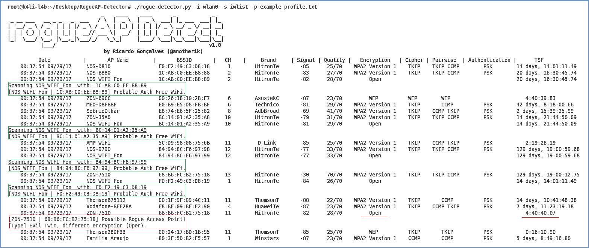

# RogueAP Detector

_rogueAP Detector_ is an open source tool to detect Wi-Fi Rogue Access Points, covering the most commonly known attacks.  This tool is a modular framework composed of Scanners, Detectors and Actuators, which are responsible for scanning for available APs, apply a set of heuristics to detect them, and apply a defensive mechanism.  

## Modules
<pre>
<b>Scanners</b>: Methods to scan the network  
<b>Detectors</b>: Set of passive detectors to identify RogueAP types  
<b>Actuators</b>: Set of active detectors to identify RogueAP types  
</pre>

## Usage
./rogueAP_detector.py <options>  

Options:  

	-i interface		-> interface to monitor the network  
	-im interface		-> interface for active mode  
	-p profile              -> name of the profile to load  
	-s scan_type            -> name of scanning type (iwlist, scapy)  
	-h hive_mode		-> creates an AP  
	-d deauth               -> deauthenticates users from target AP  
	-deauth_detect          -> detects deauthentication attacks  
	-a active_mode		-> activates random probe requests  

Examples:  

<pre>
<b> Scan for RAPs without a profile - (iwlist mode)</b>  
./rogueAP_detector.py -i iface -s iwlist  

<b> Scan for RAPs using a profile - (iwlist mode)</b>  
./rogueAP_detector.py -i iface -s iwlist -p example_profile.txt  

<b> Scan for RAPs using a profile - (scapy mode)</b>  
./rogueAP_detector.py -i iface -s scapy -p example_profile.txt  

<b> Scan for RAPs using a profile and karma detect active mode enabled - (iwlist mode)</b>  
./rogueAP_detector.py -i iface1 -im iface2 -s iwlist -p profile.txt -a  

<b> Create a RAP</b>  
./rogueAP_detector.py -im iface -h  

<b> Deauthenticate defensive mechanism mode</b>  
./rogueAP_detector.py -im iface -d  

<b> Deauthentication attacks detection</b>  
./rogueAP_detector.py -im iface -deauth_detect  
</pre>

## Dependencies
python2.7  
scapy  
wireless-tools  
iw  

To install the dependencies, run: **./dependencies.sh**  
